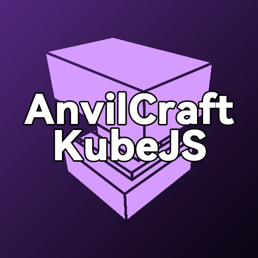

# AnvilCraft-KubeJS

## License

* Code unless otherwise stated default to our [LICENSE file(LGPL-3.0)](./LICENSE) here
* Non-Code assets (Located here) go by our [ASSET_LICENSE file(ARR)](./ASSETS_LICENSE) here
